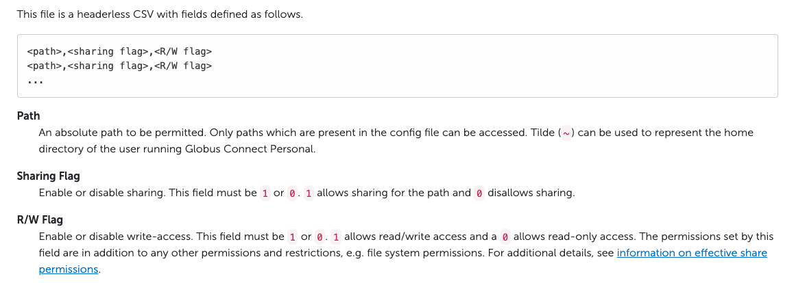
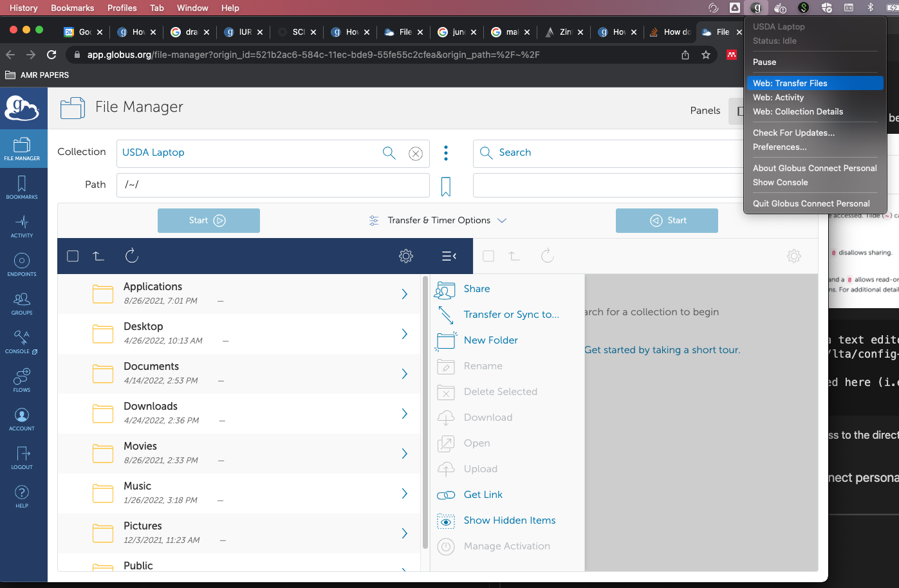
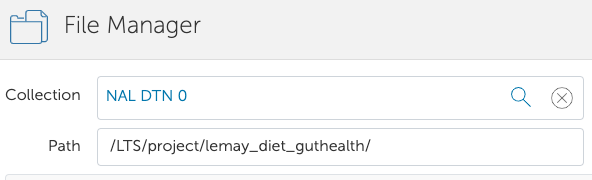
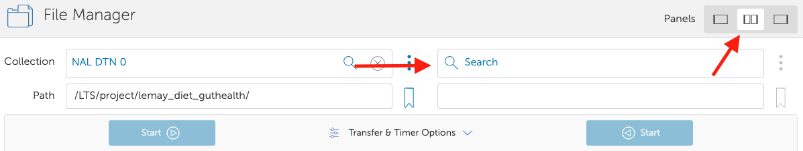
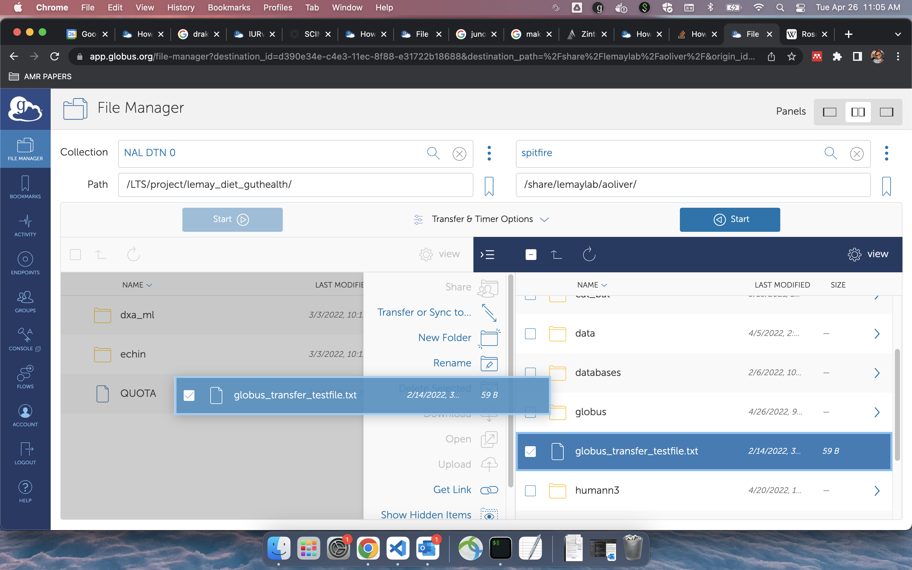

## **Transferring files from UC Davis Genome Center Spitfire to USDA Juno**

Andrew Oliver
____________
Listed here are instructions for moving data from (specifically) Spitfire to the USDA Juno archive servers. These instructions will likely work, with small changes, to other HPC environments. **These instructions also assume you have the application "Globus Connect Personal" ALSO installed on your personal machine**. If you need some help with that, follow the USDA instructions located here: https://scinet.usda.gov/guide/file-transfer/#globus-connect-personal (super easy...keep in mind if you are on a mac, you will have to give globus permission to any folders you want it to have access to. This should be apparent from system prompts though).


### 1. Log on to Spitfire and navigate to your home directory

```
$ ssh user@spitfire.genomecenter.ucdavis.edu
$ cd /share/lemaylab/$USER
```

### 2. Download Globus connect personal for Spitfire

```
$ wget https://downloads.globus.org/globus-connect-personal/linux/stable/globusconnectpersonal-latest.tgz

$ tar xzf globusconnectpersonal-latest.tgz

# this will produce a versioned globusconnectpersonal directory
# replace `x.y.z` in the line below with the version number you see

$ cd globusconnectpersonal-x.y.z
```

### 3. Start up a globus connect personal instance
Note: The first time you run this, it may try a set-up process. This is necessary for it to work, so follow the prompts. I believe it will ask you to name your "server" (i dont actually know what it is, but i will suggest how you name it...). Name the "server" spitfire_$USER (for example spitfire_aoliver)

```
$ ./globusconnectpersonal -start &
```

Next you can check if it  is up and running!

```
$ ./globusconnectpersonal -status
```

You should see something like this if it is running:

```
$ ./globusconnectpersonal -status
Globus Online: connected
Transfer Status: idle
```

### 4. Awesome. Now more tricky stuff. We need to find the endpoint id of your personal instance now. 
Here is the slightly janky way i figured it out.

```
$ cat ~/.globusonline/lta/client-id.txt
```
Ok that wasn't tricky at all...but it was tricky finding that information the first time (trust me). The resulting string is your **personal endpoint** on Spitfire. Keep this information handy, maybe even copy it.

### 5. Next we should give globus permission to read more than just your $HOME dir, especially since the data is probably elsewhere
You can do this using your favorite text editor in terminal (vim/nano) or if you dont feel comfortable with that, follow the instructions below.

The format for text should be:

FULL/path/to/directory/or_file,0,1

The information of what that means can be found in this [document](https://docs.globus.org/how-to/globus-connect-personal-linux/) (and below:)




```
# to add a line to a file without opening a text editor
$ echo "path/to/file,0,1" >> ~/.globusonline/lta/config-paths 

# or to edit in an editor, edit file located here (e.g.):
$ nano ~/.globusonline/lta/config-paths
```
Cool! So what we just did was give was give read/write access to the directory with the data, which is necessary in order to copy it over to Juno. For these changes to take effect, go ahead and stop and start Globus again:

```
$ ./globusconnectpersonal -stop
$ ./globusconnectpersonal -start &
```

### 6. Everything is set-up! Now we open up globus connect personal on our local machine and transfer files!

Start the globus connect personal application on your computer. Once that is started, for macs, navigate to the web-transfer window:



The defualt is to automatically have your local machine as an endpoint. We dont want that though, so click on where it says Collection USDA Laptop in the above image and change the endpoint.

What will we change it to? Lets set that to **JUNO**. Search the collections for **NAL DTN 0**. This is the collection name for the Juno endpoint.

- In order to log in to Juno, use the same strategy as logging into Ceres using globus:

  - Username: SCINET username (usually something like rosalind.franklin)

  - PASSWORD: scinetpassword+two-factor_authentication_code (e.g. password123456)
- Next navigate to the project directory in the Path
  - Path: /LTS/project/lemay_diet_guthealth/


  

Cool, now we have one endpoint set up. Use the window below the collection/path to navigate the folder structure. You can right click to make new folders too. **ANYTHING YOU DELETE HERE WILL BE DELETED FOR GOOD.**

Wait. Did you read that?

**ANYTHING YOU DELETE HERE WILL BE DELETED FOR GOOD.**

Ok. Next we have to set up the Spitfire endpoint. Make sure you have the panel view as side-by side, and click the other Collection search:



What we will search for here is the **personal endpoint** string I told you to keep handy from step #4. What should appear from a search of that endpoint ID is the name of the "server" you made in the globusconnectpersonal set-up on Spitfire. Click on that!

- It should ask you to log in. Log in with your normal Spitfire credentials
- This the resulting directory will be $HOME. Most of us dont have anything in $HOME. In order to transfer your files of interest, navigate to the path where they exist. 
  - **NOTE:** Any path you navigate to MUST be in the config-paths file, with R/W permission, which we already did in Step 5. 
- Now we can click and drag files we want to copy over to Juno from Spitfire:




### 6. Finishing up

Once you are done with the transfer, it probably is a good idea to close down the server on Spitfire (if you changed directories out of globusconnectpersonal-x.y.z, get on back there, thats where the executable lives). 

```
$ ./globusconnectpersonal -stop

# we can check if it is no longer running by checking the status again:

$ ./globusconnectpersonal -status
```

## Troubleshooting tips:

- if you are having a hard time logging into Spitfire from Globus, try checking if you already had a Spitfire connection open through the commandline. Trying stoping it and starting it again. Your endpoint ID will not change.
  - ```$ ./globusconnectpersonal -stop ```
  - ```$ ./globusconnectpersonal -start & ```
- If you cant open a directory in globus for Spitfire, check that config-paths file and make sure the path is correct
- If you cant open the project directory, make sure you have permission to access it. Ask the project directory owner, or in Ceres, run:
  - ``` /usr/local/bin/my_quotas ```

-----------
Last modified: April 26, 2022