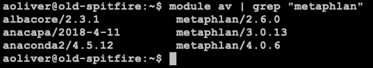
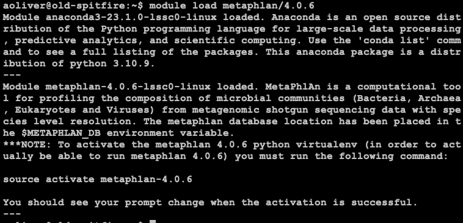
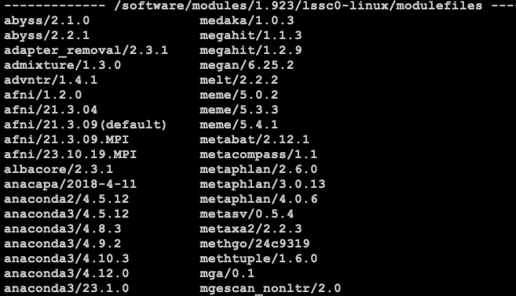

## *"Submitting" jobs to New Spitfire*
By Andrew Oliver, PhD
### **Introduction**
This short tutorial should give you an idea of how to "submit" jobs to new spitfire. This especially useful when things are super busy on Barbera.

**NOTE:** If you are running a super long job (i dont know, more than 2 days for an individual job), or you require A TON of resource, consider just waiting out Barbera.

**NOTE:** Also this is kind "pro" level stuff. If any of this is to intimidating, thats ok! But learn before you do! And start small! There are a ton of reasons why you dont want to do this (huge i/o requirements?). 

### 1. Logging onto New Spitfire
Replace USER with your username
```
## log into new spitfire
ssh -o "ServerAliveInterval 60" -o "ServerAliveCountMax 240" USER@spitfire.genomecenter.ucdavis.edu
```

### 2. Getting module information from old spitfire
New spitfire does not have the same modules that old-spitfire or Barbera does. But it can still use them! What you need  to do is find out the full path of them if you dont know them.

Ok so if you logged into new spitfire above, log out now. Lets go get those paths from old-spitfire!

```
## log into old spitfire
ssh -o "ServerAliveInterval 60" -o "ServerAliveCountMax 240" USER@old-spitfire.genomecenter.ucdavis.edu
```
Let's look up ALL the modules availible 
```
module av
```
Wow. Thats a big list. Lets see if we cant just focus on metaphlan
```
module av | grep "metaphlan"
```



Ok, so we found it. Lets load it and make sure there are not any special instructions for it.
```
module load metaphlan/4.0.6
```



So there ARE extra instrucitons on how to load metaphlan. The key notes here are:

"... you must run the following command:
source activate metaphlan-4.0.6"

Cool, we'll make note of that. If the package you are loading does not print anything out, chances are it does not have any special extra requirments for loading the package.

Metaphlan is an extra tricky one. Notice that the module loaded when you run ```module load metaphlan/4.0.6``` is not metaphlan at all actually. See the beginning of that print out Module anaconda3-23.1.0-lssc0-linux loaded. So thats the module we actually need. This is a conda module that has many enviornments in it, one of which is metaphlan.

So we need the full path of where anaconda3-23.1.0 is installed at. Run that ```module av``` command again and pay special note to the "headers" of the software sections:



So anaconda3/23.1.0 is installed at ```/software/modules/1.923/lssc0-linux/modulefiles```. Lets make note of that! *Not all packages are installed in the same path!!*

Now we are done with old-spitfire. We found the information we needed. Close out that terminal and open a new one for new spitfire (see step 1).

### 3. Setting up your script

First of all, again, make sure you are on new spitfire

Replace USER with your username
```
## log into new spitfire
ssh -o "ServerAliveInterval 60" -o "ServerAliveCountMax 240" USER@spitfire.genomecenter.ucdavis.edu
```

Next, lets make a script. You can do this with your favorite script editor, I am not going to show you how to do that. I will give you some fake scripts though. This is how i parallize things on new spitfire. Maybe its a little janky...it uses a "while loop" (instead of "for loop"). Feel free to read more about this on your fav shell scripting website.

**MAIN SCRIPT BODY (main_script.sh)**

```
#!/bin/bash

WORKDIR=/path/on/new_spitfire/whereimworking
RESULTS=${WORKDIR}/results

while read subject fasta_path; do

## make scripts
echo "#!/bin/bash

## make sure your script is working in your work dir
cd ${WORKDIR}

## load your modules (from all that work above!)
## specific for metaphlan 4.0.6
module load /software/modules/1.923/lssc0-linux/modulefiles/anaconda3/23.1.0
source activate metaphlan-4.0.6

## run your command!
metaphlan [options] --output ${RESULTS}/${subject}.metaphlan.out ${fasta_path}

" > script_${subject}.sh

done < subject_paths.txt
```

**subjects_paths.txt**

This file is necessary for the above script to work. It just contains 2 columns, one for the subject and one for the fasta path:

```
1123    /full/path/to/1123.fasta
1124    /full/path/to/1124.fasta
1125    /full/path/to/1125.fasta
```

### 4. Making scripts

So once you have the main script and the subject_paths.txt script ready, you need to run that script! This will generate scripts, one for each line in subject_paths.txt:

```
bash main_script.sh
```

You note that this runs in a second, and when you look at your folder, you now have a bunch of scripts, such as script_1123.sh, script_1124.sh, etc.

### 5. Magic sauce - GNU parallel. "Submitting" jobs
Now you want all these scripts to run on spitfire, without you needing to babysit them. Or you dont want to wait for a for-loop. First things first: **CHECK AND SEE HOW BUSY SPITFIRE IS!!**

Since you are already on spitfire you can run:

```
htop
# press q to quit

## OR you can run
top
# press q to quit
```

If you cant read these reports, you need to learn how to before you proceed. You could really slow down Spitfire. This is BAD. Other people will be (minimum) frustrated with you.

Ok, assumming its pretty empty, time to get GNU parallel running for you. If your jobs are going to take a long time, its probably a good idea to get a screen session started. Look this up if you dont know how (IF YOUR TERMINAL CONNECTION BREAKS, YOUR JOBS WILL STOP).

On a screens session:

```
parallel -j 10 --dryrun bash {} :::: <(ls -l script_*.sh | cut -d" " -f10)
```

That will print out the commands that parallel sees. It will not run them! If everything looks good, remove --dryrun:

```
parallel -j 10 bash {} :::: <(ls -l script_*.sh | cut -d" " -f10)
```

So what is happening here?
- You are calling parallel
- You are saying, run 10 jobs at a time. If one finishes, start the next job. At any one time, only 10 jobs will be running
  - **NOTE:** This are jobs! To know how many cores you are using, multiple 10 * the number of cores an individual job uses.
- ```bash {}``` is just "running" the shell script (i.e. script_1123.sh)
- ```<(ls -l script_*.sh | cut -d" " -f10)``` is a bit of fancy subsitution. It is basically making a list of all the scripts you made and feeding them into parallel.


Thats it! Again, this is a rather complicated affair...but it gets easier the more you do it. And, most of all, you are probably getting your jobs running instantly instead of wating for the (often crowded) queues on Barbera. Some good tips are:

1. Run one script (ie script_1123.sh) and make sure it runs before you run parallel. 


